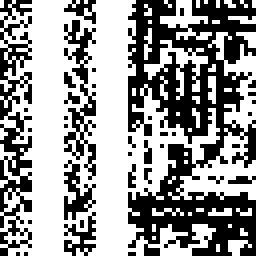

# Strata implementation #

This a work-in-progress implementation of Strata, as described in the paper
"Strata: layered coding for scalable visual communication" by Hu et al.
(http://dl.acm.org/citation.cfm?id=2639132)

Please note that this is not an authoritative implementation and the
author of this source is not affiliated with the authors of Strata.

## Capacity ##

The generated codes have four layers and a capacity of 2267 bits:

* The first (highest) layer block encodes 3 bits (1 bit for color, 2
  bits for orientation of the reserved block) directly, and 1024 bits in
  extra strips in the reserved area; there is one first layer block.
* A second layer block encodes 3 bits directly, and 64 bits in extra
  strips; there are 8 second layer blocks.
* A third layer block encodes 3 bits; there are 8^2=64 third layer
  blocks.
* A fourth layer block encodes 1 bit (only color); there are 8^3=512
  fourth layer blocks.

Total capacity: 1\*(3+1024) + 8\*(3+64) + 8^2\*3 + 8^3\*1 = 2267.

## Ambiguity ##

Currently, no block mask is applied to the payload, so most payloads
will lead to ambiguous codes, i.e., codes that could be decoded to
different payloads. Consider the following block:

    0 0 1 0
    0 0 0 1
    0 0 0 0
    0 0 0 0

For this block, it is not possible to determine if the reserved block is
to the left or on the bottom.

## Example code ##

See the IPython notebook `notebook/Example.ipynb` for how to generate a
code. A generated code may look like this:

